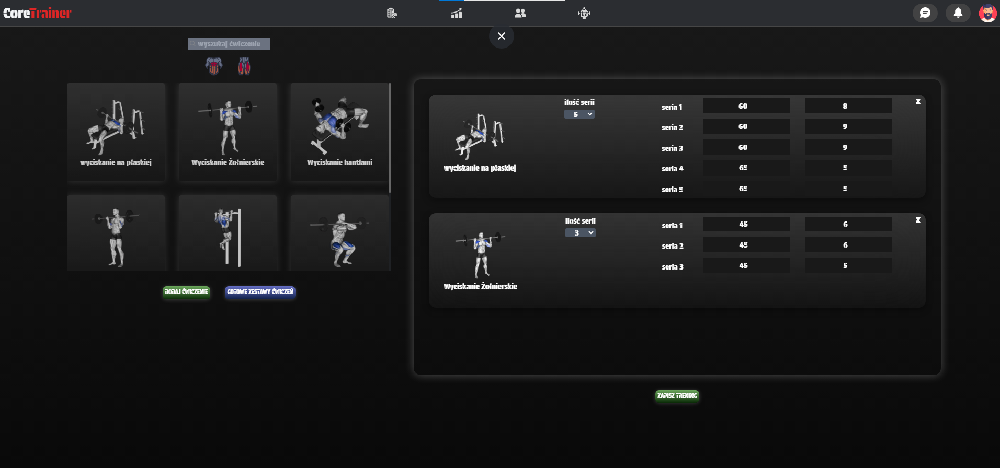
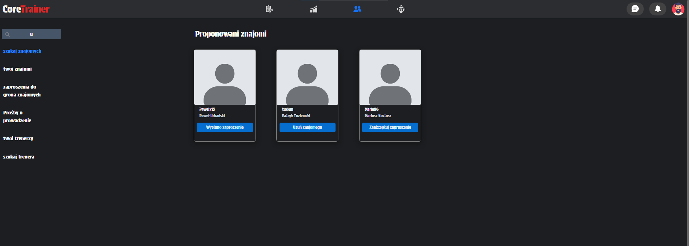
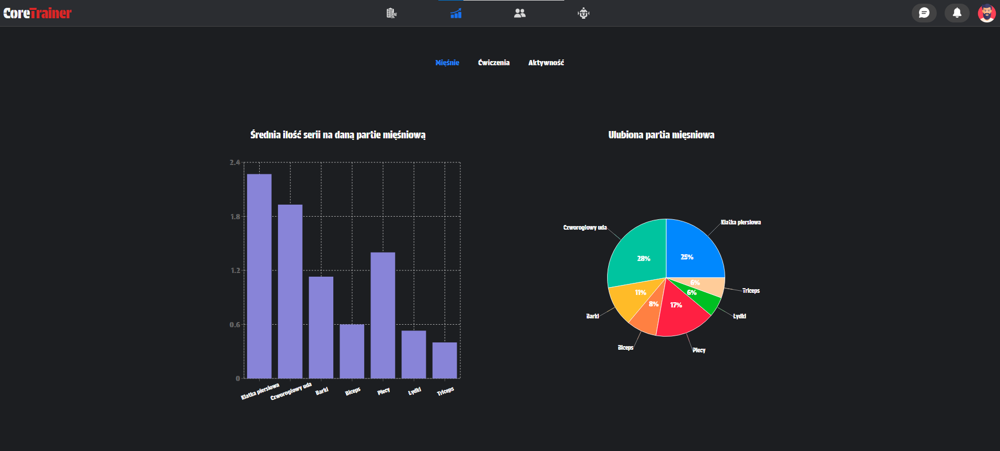

# CoreTrainer – (Wstępna Wersja) Kompleksowy System Zarządzania Treningiem

**CoreTrainer** to rozbudowana aplikacja webowa wspierająca zarówno **Podopiecznych**, jak i **Trenerów** w efektywnym zarządzaniu treningiem, monitorowaniu postępów oraz utrzymywaniu stałej komunikacji.  
> **Uwaga:** Jest to **mocno wstępna wersja** projektu — projekt wymaga wielu zmian i aktualizacji aby w pełni oddawał swoją funkcjonalność.

---

## Spis treści
1. [Funkcjonalności](#funkcjonalności)
   - [Podopieczny (Użytkownik)](#podopieczny-użytkownik)
   - [Trener](#trener)
   - [Relacje i Znajomi](#relacje-i-znajomi)
   - [Ankieta Startowa (Survey)](#ankieta-startowa-survey)
   - [Statystyki i Wykresy](#statystyki-i-wykresy)
   - [Dodatkowe Funkcje](#dodatkowe-funkcje)
2. [Technologie](#technologie)
3. [Struktura Plików](#struktura-plików)
---

## Funkcjonalności


### Podopieczny (Użytkownik)
- **Tworzenie własnych ćwiczeń** 
- **Zapisywanie treningów** (data, liczba serii i powtórzeń).  
- **Zarządzanie zestawami ćwiczeń**: możliwość zapisywania całego planu treningowego jako tzw. *WorkoutSet*.  
- **Kalendarz treningowy**: wyświetlanie treningów przypisanych do poszczególnych dni, co ułatwia planowanie tygodnia.  
- **Odczyt planów trenera**: podopieczny widzi nadane zestawy lub treningi i może je kopiować bądź modyfikować.




### Trener
- **Relacje trener–podopieczny**: trener może zaprosić (bądź zostać zaproszony) do współpracy.  
- **Rozsyłanie planów treningowych**: tworzenie zestawów ćwiczeń i *pushowanie* ich do konkretnych podopiecznych.  
- **Kreator ćwiczeń**: zarządzanie bazą ćwiczeń (dodawanie grafik, przypisywanie partii mięśniowej).  
- **Monitorowanie wyników**: odbieranie raportów siłowych i przegląd 1RM, objętości itp.  
- **Zarządzanie kilkoma podopiecznymi** w prostym panelu (listowanie, usuwanie, modyfikowanie współpracy).


### Relacje i Znajomi
- **System znajomych**: wysyłanie zaproszeń, akceptowanie / odrzucanie.  
- **Zaproszenia do współpracy**: status *pending*, *active*, *rejected*, *expired* (logika z użyciem cron).  
- **Elastyczne Role**: użytkownik może być jednocześnie Trenerem i Podopiecznym.

 

### Ankieta Startowa (Survey)
- **Pierwsze logowanie**: wypełnianie płci, wieku, wagi, celu, roli (Podopieczny / Trener).  
- **Kompetencje trenerskie**: użytkownik wybiera, które usługi oferuje (np. dietician, performanceCoach).  
- **Zapisywanie stanu** w bazie (pole `user.userFeatures`).

### Statystyki i Wykresy
- **Recharts** (PieChart, BarChart, LineChart, etc.) do analizy postępów.  
- **Responsywność** wykresów: *ResponsiveContainer*, media queries, `clamp` w CSS.



### Dodatkowe Funkcje
- **Redux** do zarządzania stanem globalnym (np. logowanie, aktualny użytkownik).  
- **React Query** do fetchowania danych i cache’owania (np. `useWorkouts`, `useFriends`).  
- **Multer** w backendzie do obsługi plików (obrazki ćwiczeń).  
- **Cron** (node-cron) do automatycznej zmiany statusu współpracy (np. *expired*).

---

## Technologie
- **React (TypeScript)** / **Next.js**  
- **Redux** & **React Query**  
- **Node.js + Express** (REST API)  
- **MongoDB + Mongoose**  
- **JWT** (autoryzacja)  
- **Multer** (upload plików)  
- **Tailwind / CSS Modules**  
- **SweetAlert2** (alerty i potwierdzenia)  
- **cron** (zautomatyzowane zadania)

---

## Struktura Plików

Poniżej uproszczony obraz katalogów;

```bash
.
├── .vite/
├── node_modules/
├── public/
├── server/
│   ├── models/                
│   ├── uploads/                
│   ├── index.ts               
│   ├── package.json
│   ├── tsconfig.json
│   └── .env
├── src/
│   ├── api/                    
│   ├── assets/                
│   ├── components/         
│   │   ├── features/
│   │   │   ├── firstLoginSurvey/
│   │   │   ├── loggedSections/
│   │   │   │   ├── sharedSections/
│   │   │   │   ├── TrainerSections/
│   │   │   │   └── userSections/
│   ├── hooks/                
│   ├── store/                
│   ├── main.tsx               
│   ├── App.tsx
│   └── ...
├── package.json
├── vite.config.ts
└── README.md
```
